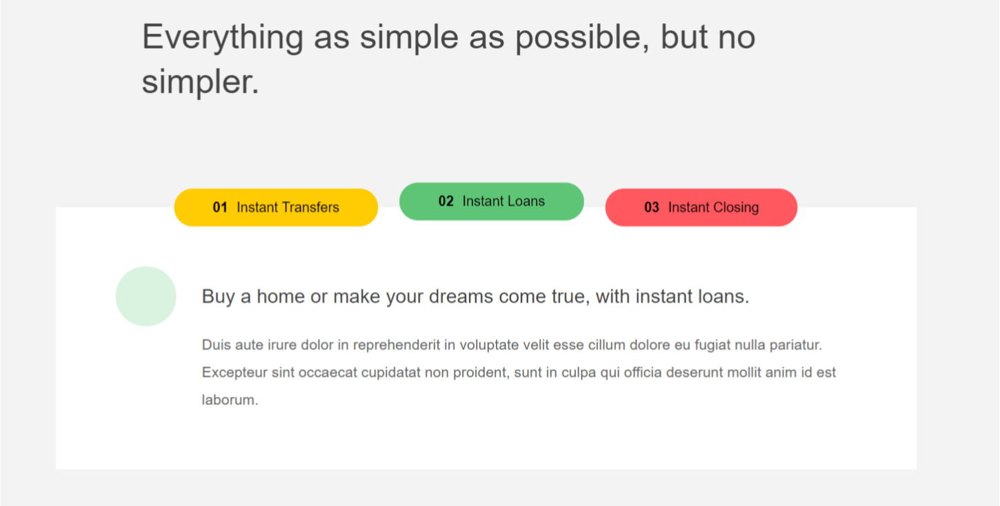
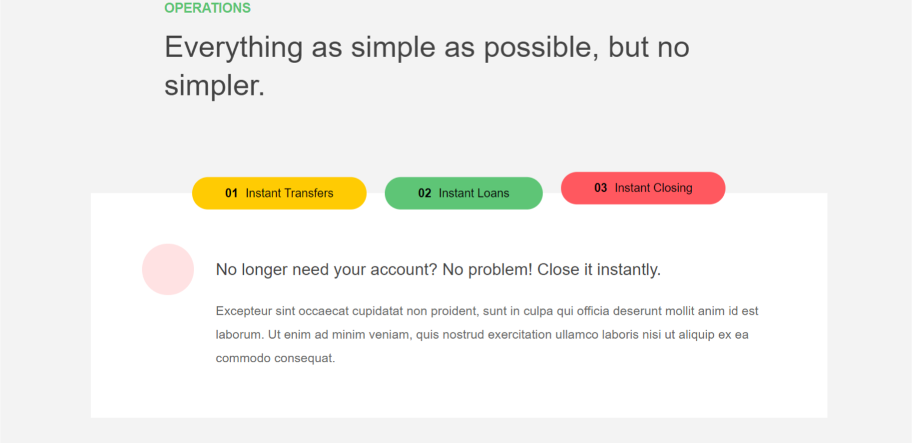

# TABS

> This project is a part of our dev-club activity and will focus on dom manipulation. basic dom manipulation knowledge is required, html & css as well. We provided you with a section from a project we found online including pre-built working html and CSS files.

---

### Table of Contents

- [Challenge Languages](#Languages)
- [Instructions](#Instructions)
- [Preview](#Preview)

---

## Languages

* HTML
* CSS
* JS

---

## Instructions

- [X] Clone this repository.
- [X] Checkout to the starting-files branch
- [X] Add a functionality to the project witch will make the tabs switch like in the example below. (you can change the html or the css files provided). 

---
## Preview

